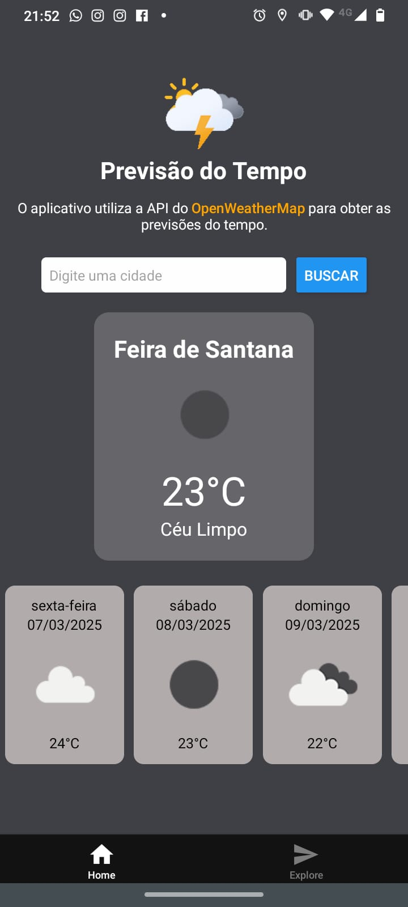

<h1 align="center">🌤️ Mobile App para Consulta da Previsão do Tempo</h1>

<p align="center">
  
</p>

<p align="center">
  Aplicativo mobile desenvolvido com <a href="https://expo.dev" target="_blank">Expo</a> e <a href="https://reactnative.dev/" target="_blank">React Native</a>, consumindo a API da <a href="https://openweathermap.org/" target="_blank">OpenWeatherMap</a>.
</p>

---

## 📖 Sobre o Projeto
Este app foi desenvolvido como parte de um teste técnico com o objetivo de criar uma aplicação em **React Native** utilizando **Expo** e consumo de API.  

Funcionalidades da aplicação:  
✅ Condições climáticas **atuais** para a localização do usuário  
✅ Previsão estendida para os **próximos 5 dias**  
✅ Interface simples e intuitiva  

---

## 🚀 Tecnologias Utilizadas
- [React Native](https://reactnative.dev/)  
- [Expo](https://expo.dev/)  
- [TypeScript](https://www.typescriptlang.org/)  
- [OpenWeatherMap API](https://openweathermap.org/api)  

---

## 🛠️ Como Executar o Projeto

1. **Clone o repositório**  
   ```bash
   git clone https://github.com/lmdvlpr/weather-mobile-app.git
   ```
---

2. **Acesse a pasta do projeto**  
   ```bash
   cd weather-mobile-app
   ```
---

3. **⚙️ Configuração da API Key**

    Este app utiliza a API da **OpenWeatherMap**.
    Crie um arquivo `.env` na raiz do projeto e adicione sua chave:
    
    ```env
    EXPO_PUBLIC_OPENWEATHER_API_KEY=your_api_key_here
    ```
    
    No código, a chave é acessada via:
    
    ```ts
    process.env.EXPO_PUBLIC_OPENWEATHER_API_KEY
    ```
---

4. **Instale as dependências**

   ```bash
   npm install
   ```
---

5. **Inicie a aplicação**

   ```bash
   npx expo start
   ```
---

6. **Execute no celular**

   * Escaneie o QR Code gerado com o aplicativo **Expo Go** (disponível na Play Store/App Store).


